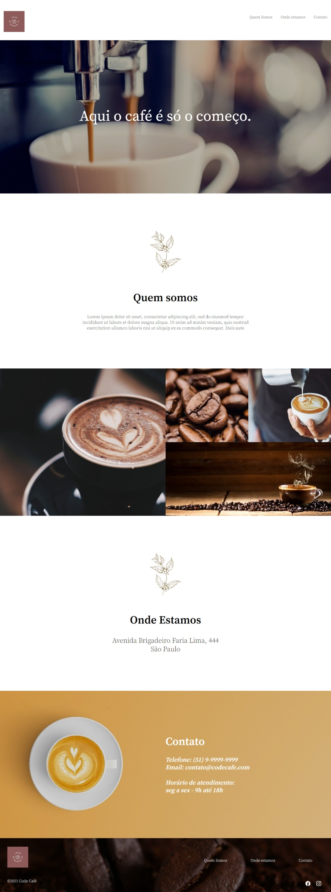

# Landing-page-CodeCafe

Projeto de Landing Page desenvolvida no Devquest utilizando conceitos básicos de HTML e CSS, apesar de básicos já foram aplicados conceitos de responsividade em diversos dispositivos, você pode conferir o projeto no link abaixo.

[Site Do Projeto](https://martvie.github.io/Landing-page-CodeCafe/)

## imagens do projeto

## Tecnologias utilizadas

* HTML
* CSS
